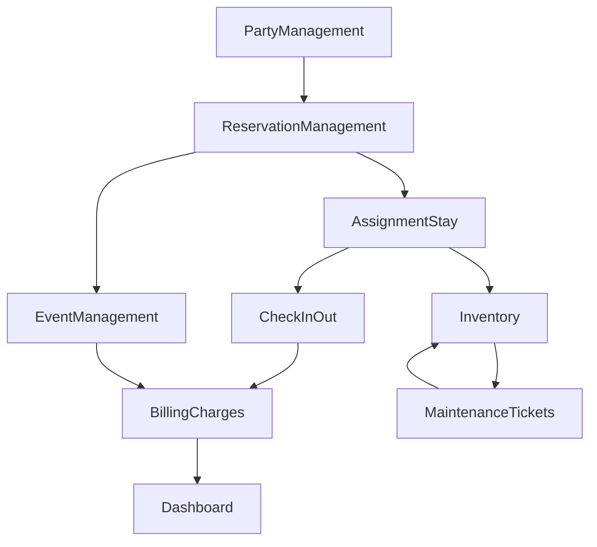

# Last Resort System Page Spec (Requirement Coverage)

This document implements the approved plan for Last Resort page coverage and translates it into build-ready page requirements.

## 1) Confirmed Mandatory Scope (P0)

The following 8 pages are mandatory for milestone delivery:

1. Dashboard
2. Inventory (Space & Room Resource)
3. Party Management
4. Reservation Management
5. Assignment & Stay
6. Event Management
7. Billing & Charges
8. Maintenance Tickets

Acceptance rule for P0: the team can run one full business demo flow end-to-end:

`Create Party -> Create Reservation -> Assign Room -> Check In/Out -> Record Charges -> Review Bill -> View Operations Dashboard`

## 2) Page-by-Page Functional Spec (P0)

All field names below are aligned to `Group9_milestone2_create.sql`.

### Page 1: Dashboard

Purpose: executive and daily operation overview with quick drill-down.

Data widgets:
- Total revenue (from `charge.chargeAmount` by date range)
- Active assignments (count active rows in `room_assignment` for ongoing stays)
- Total hosted events (from `event`)
- Average stay duration (from `stay.checkinTime`, `stay.checkoutTime`)
- Open maintenance tickets (from `maintenance_ticket.status`)
- Occupied vs available room count (from `room.currentStatus`)

Filters:
- Date range (`startDate`, `endDate` style filter)
- Building (`buildingId`)
- Wing (`wingId`)
- Party type (`party.partyType`, optional)

Actions:
- Click KPI to open related page with filters preserved
- Export KPI snapshot (CSV)

### Page 2: Inventory (Space & Room Resource)

Purpose: manage physical hierarchy, room capabilities, and availability.

Primary views:
- Hierarchy browser: `hotel -> building -> wing -> floor -> room`
- Room detail panel
- Adjacency and capability panel

Core fields:
- Building level: `buildingName`
- Wing level: `wingCode`, `nearPool`, `nearParking`, `handicapAccess`
- Floor level: `floorNumber`, `nonSmokingFloor`
- Room level: `roomNumber`, `baseRate`, `maxCapacity`, `currentStatus`
- Room functions: `functionCode`, `functionName`, `room_function.activeness`
- Bed setup: `bedTypeId`, `name`, `capacity`, `quantity`, `isFoldable`
- Room links: `room_adjacency.roomId1`, `roomId2`, `connectionType`

Actions:
- Add/update room basic info and status
- Add/remove room function mapping
- Add/update bed configuration
- Add/update adjacency relationship
- Mark room unavailable (maintenance/cleaning)

### Page 3: Party Management

Purpose: maintain billable and contactable customer entities.

Core fields:
- Party profile: `partyId`, `partyType`, `contactPersonName`, `email`, `phone`
- Group members: `guest_group.guestId`, `guestName`
- Billing account summary: `billing_account.accountId`, `status`, `creditLimit`

Actions:
- Create/edit party profile
- Add/remove group members
- Link to party reservations, events, accounts
- Search by name/email/phone/party type

### Page 4: Reservation Management

Purpose: capture booking demand and customer requirements before assignment.

Core fields:
- Header: `reservationId`, `partyId`, `dateCreated`, `status`
- Time: `startDate`, `endDate`
- Financial: `depositRequired`, `depositAmount`
- Requirement notes (UI-level field mapped to future extension; keep as free text for now)

Validation rules:
- `endDate >= startDate`
- If `depositRequired = 0`, default `depositAmount = 0`

Actions:
- Create reservation
- Update reservation dates/status/deposit
- Cancel reservation (status update)
- Compute lead-time bucket for operations review

### Page 5: Assignment & Stay

Purpose: execute near-term allocation and actual check-in/out operations.

Core fields:
- Assignment: `assignmentId`, `reservationId`, `roomId`, `assignmentDate`
- Stay lifecycle: `stayId`, `reservationId`, `checkinTime`, `checkoutTime`
- Room operational state: `room.currentStatus`

Actions:
- Assign one reservation to one or more rooms (multiple assignments allowed)
- Re-assign room when needed (last-minute operational change)
- Check-in (create `stay` with check-in timestamp)
- Check-out (update `checkoutTime`)
- Guardrail: block assignment to rooms in `Maintenance` state

### Page 6: Event Management

Purpose: manage non-overnight or mixed event usage of facilities.

Core fields:
- Event profile: `eventId`, `hostPartyId`, `eventType`
- Schedule: `startTime`, `endTime`, `usageTime`
- Scale: `estimatedGuestCount`
- Room allocation: rows in `event_room` (`eventId`, `roomId`)

Validation rules:
- `endTime >= startTime`
- Room cannot be double-booked within overlapping event windows (application-level validation)

Actions:
- Create/update event
- Assign/remove event rooms
- View event-room occupancy and conflict warnings

### Page 7: Billing & Charges

Purpose: maintain accountable billing and real-time charge visibility.

Core fields:
- Account: `accountId`, `partyId`, `status`, `creditLimit`
- Charge entry: `chargeId`, `serviceCode`, `chargeAmount`, `dateIncurred`, `stayId` (nullable)
- Service catalog: `service_type.serviceCode`, `serviceType`, `baseRate`

Actions:
- Create/manage billing account
- Record charge (stay-linked or standalone)
- Review charge ledger by account/date/service
- Calculate account total and export statement

### Page 8: Maintenance Tickets

Purpose: track facility issues and protect operational assignment quality.

Core fields:
- Ticket: `ticketId`, `roomId`, `issueDescription`, `status`
- Time tracking: `dateCreated`, `dateResolved`

Validation rules:
- `dateResolved >= dateCreated` if resolved

Actions:
- Create/update/resolve ticket
- Filter by status/room/building/wing
- Trigger room status update workflow (`Maintenance`/`Available`)

## 3) Navigation and Cross-Page Workflow

### Sidebar navigation

- Dashboard
- Inventory
- Parties
- Reservations
- Assignments & Stay
- Events
- Billing
- Maintenance
- Insights (P1 extension)

### Primary cross-page links

- Dashboard KPI -> destination page with active filters
- Reservation detail -> Assignments & Stay
- Assignment record -> Room detail (Inventory)
- Party profile -> Reservations / Events / Billing account history
- Event detail -> Billing (event-related charges)
- Maintenance ticket -> Inventory room status

### Demo workflow map

## 4) Query-to-Widget Mapping (Dashboard + Insights)

All mappings use existing SQL in `Group9_milestone2_query.sql`.

### Dashboard mappings

- KPI: Active assignments
  - Source query base: Query 9 (room turnover) plus active date filter from assignments/stays
- KPI: Total events hosted
  - Source query base: Query 5
- KPI: Total revenue
  - Source query: Query 6 and Query 10
- KPI: Average stay duration
  - Source query: Query 2
- KPI: Open maintenance tickets
  - Source query base: Query 8 with status filter
- Chart: Occupied vs available by building
  - Source query base: extend Query 1 with `room.currentStatus`

### Insights page mappings

- Visual 1: Room usage by building/wing (bar chart)
  - Query 1
- Visual 2: Avg usage duration by party type (bar chart)
  - Query 2
- Visual 3: Reservation lead-time and deposit pattern (stacked bar/table)
  - Query 3
- Visual 4: Bed configuration in assigned rooms (bar chart)
  - Query 4
- Visual 5: Event size and room usage (bubble/table)
  - Query 5
- Visual 6: Revenue by service type (donut/bar)
  - Query 6
- Visual 7: Top billed parties (leaderboard table)
  - Query 7
- Visual 8: Maintenance burden by building/wing (heatmap/bar)
  - Query 8
- Visual 9: Top room turnover (ranked table)
  - Query 9
- Visual 10: Monthly revenue trend by service type (multi-line chart)
  - Query 10

## 5) Build Sequence Recommendation

1. Build pages 3, 4, 5, 7 first (business transaction backbone).
2. Build pages 2 and 8 (resource + operational constraints).
3. Build page 6 (events).
4. Build page 1 (dashboard integration).
5. Add Insights page as P1 using existing 10 queries.
